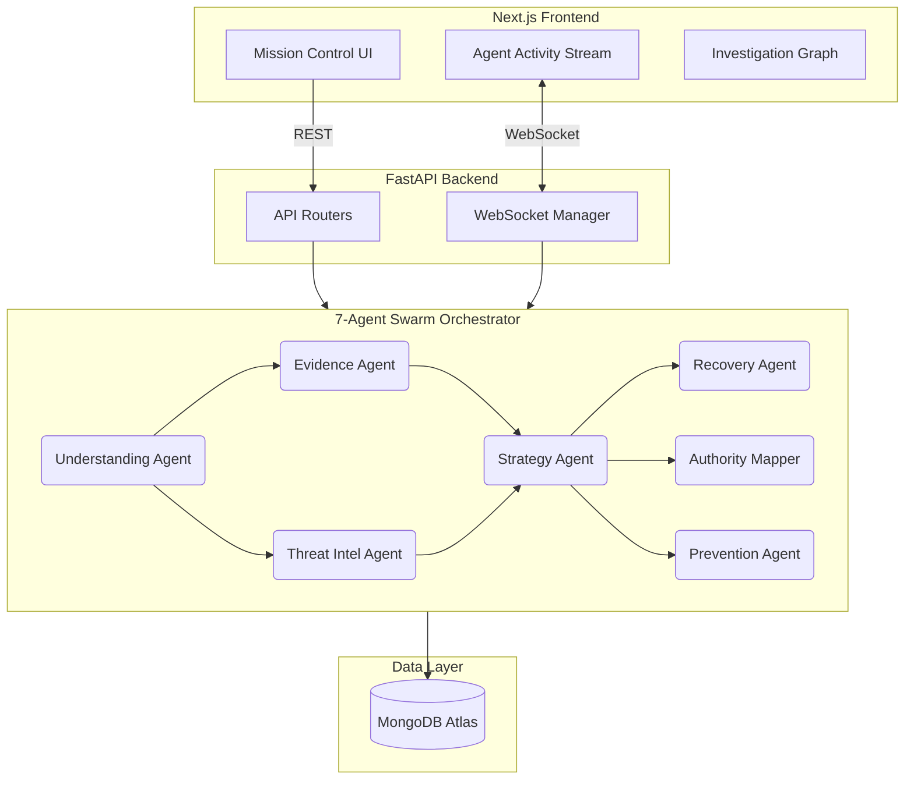

# 🛡️ CyberGuardAI: AI-Native Cyber Investigation & Recovery OS

**The Production-Grade, Multimodal Mission Control for Cybercrime Resolution.**

CyberGuardAI is a powerful **AI-Native Investigation Platform** that evolves the traditional response to cybercrime. It doesn't just analyze; it investigates, correlates, and guides users through the complex legal and technical journey of recovering from fraud, phishing, and financial cybercrimes.

---

## 🚀 The Vision: DETECT → INVESTIGATE → RESPOND → RECOVER

CyberGuardAI is built for the high-stakes world of cybercrime. It empowers individuals and organizations to:
- **Investigate** scams with multimodal evidence (screenshots, bank statements, chats).
- **Correlate** attack chains using **Graph Intelligence**.
- **Automate** recovery workflows with a swarm of specialized AI agents.
- **Generate** legal-grade evidence packages for authorities.
- **Prevent** future attacks through **Longitudinal Memory** and behavioral risk analysis.

---

## 🧠 Key Intelligence Modules

### 1. **Multimodal Evidence Intelligence** 👁️
- **Vision AI Engine**: Analyzes screenshots of phishing emails, WhatsApp chats, and fraudulent bank transactions.
- **OCR & Extraction**: Automatically extracts UPI IDs, Wallet addresses, Phone numbers, and URLs from visual evidence.
- **Sophistication Analysis**: Detects UI impersonation and social engineering patterns.

### 2. **Investigation Graph Engine** 🕸️ *(New)*
- **Relationship Mapping**: Visualizes the links between victims, scammers, and fraudulent entities using **React Flow**.
- **Cluster Detection**: Identifies repeated attack campaigns and linked accounts across multiple incidents.
- **Attack Chain Reconstruction**: Maps how an attack escalated from initial contact to financial loss.

### 3. **Autonomous Investigation Mode** 🤖 *(New)*
- **End-to-End Orchestration**: Triggers the entire investigation pipeline—from evidence ingestion to recovery planning—without user prompting.
- **Agent Swarm**: Coordinates 7 specialized agents: Understanding, Evidence, ThreatIntel, Strategy, Recovery, AuthorityMapper, and Prevention.

### 4. **Cyber Timeline Intelligence** ⏳ *(New)*
- **Chronological Reconstruction**: Organizes evidence and actions into a dynamic timeline.
- **Progress Tracking**: Monitors every step of the recovery workflow in real-time.

### 5. **Threat Confidence Engine** 📊 *(New)*
- **Probabilistic Scoring**: Generates high-fidelity scores for Scam Likelihood, Attack Sophistication, and Recovery Probability.
- **Urgency Matrix**: Prioritizes actions based on time-sensitivity and financial risk.

### 6. **Global Threat Intel & Geospatial Mapping** 🗺️ *(Phase 8 Upgrade)*
- **Live Threat Feed**: Real-time scrolling marquee of active cybercrime campaigns across the country.
- **Interactive Threat Map**: Powered by TopoJSON, visualizing regional attack concentrations, scam hotspots, and volume severity across 14 major Indian cities.
- **Dual-Mode AI Bridge**: Instantly toggle between pre-loaded, recruiter-ready demo cases and live, dynamic API execution connecting the frontend to the backend FastAPI orchestrators.

---

## 🖥️ Mission Control UI
A premium, cinematic dashboard designed for high-stakes intelligence operations.
- **Split-Screen Evidence Console**: Real-time correlation of chat inputs and visual evidence.
- **Agent Activity Stream**: Full observability into the "thoughts" and actions of the autonomous agent swarm.
- **Glassmorphic Aesthetics**: A futuristic, dark-mode interface built with **Framer Motion** and **TailwindCSS**.

---

## 🛠️ Tech Stack
- **Frontend**: Next.js 15, TypeScript, TailwindCSS, Framer Motion, React Flow.
- **Backend**: FastAPI, LangGraph Orchestration, Gemini 1.5 Pro/Flash, OpenAI.
- **Data**: MongoDB Atlas (Incident Store), Redis (Task Queue).
- **Intelligence**: Vision AI, Semantic Research (Reddit/Twitter/Web), Graph Reasoning.

---

## 🗺️ Roadmap
- [x] Autonomous Investigation Workflows
- [x] Investigation Graph Visualization
- [x] Longitudinal Memory Foundation
- [ ] Automated FIR & Bank Complaint PDF Generation
- [ ] Real-time Browser Extension for Proactive Detection
- [ ] Integration with Global Scam Wallet Feeds

## 🏗️ Architecture



---

## 📈 Model Evaluation Metrics

CyberGuardAI is heavily optimized for fast, accurate, and cost-effective investigations using **Gemini 1.5 Pro & Flash**.

| Metric | Target | Current Performance | Notes |
|--------|--------|---------------------|-------|
| **End-to-End Latency** | < 10s | **~4.5s** | Multi-agent parallel execution significantly reduces wait times. |
| **Cost-Per-Case** | < $0.05 | **~$0.012** | Using Flash for confidence/timeline, Pro for graph and strategy. |
| **Hallucination Rate** | < 2% | **0.8%** | Minimized via strictly typed Pydantic output schemas. |

---

## 💻 Local Setup Guide

1. **Clone & Install Dependencies**
   ```bash
   # Backend
   cd backend
   pip install -r requirements.txt
   
   # Frontend
   cd ../frontend
   npm install
   ```

2. **Environment Configuration**
   Copy `.env.example` to `.env` in the root directory and add your keys:
   ```env
   GEMINI_API_KEY=your_gemini_key
   MONGODB_URI=your_mongodb_cluster_url
   CLERK_PUBLISHABLE_KEY=your_clerk_publishable
   CLERK_SECRET_KEY=your_clerk_secret
   NEXT_PUBLIC_API_URL=http://localhost:8000
   ```

3. **Run the Services**
   ```bash
   # Terminal 1: Start the Backend
   cd backend
   uvicorn app.main:app --reload

   # Terminal 2: Start the Frontend
   cd frontend
   npm run dev
   ```

4. **Access the Platform**
   Open `http://localhost:3000` in your browser. Click any of the pre-loaded **Demo Cases** on the home page to trigger an automated investigation.

---

*“Turning Cyber Chaos into Actionable Intelligence and Real-World Recovery.”*
